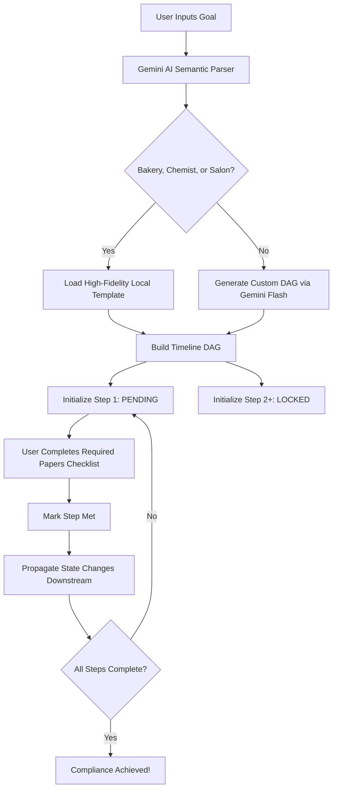

# JanSaarthi 🇮🇳
### **Goal-Oriented Administrative Compliance Platform**

JanSaarthi is an interactive, intelligent web application designed to help Indian citizens navigate the complex maze of municipal, state, and federal regulatory compliances. By converting a plain-text business or personal goal (e.g., *"I want to open a bakery"* or *"I need to change my Aadhaar name"*) into an interactive, step-by-step compliance timeline, JanSaarthi eliminates administrative information asymmetry.

**Live Prototype URL**: [https://jan-saarthi.vercel.app/](https://jan-saarthi.vercel.app/)  
**Live Backend API**: [https://jansaarthi.onrender.com](https://jansaarthi.onrender.com)

---

## 🎯 Core Intent & Value Proposition
In India, setting up a new business or updating government documents typically involves navigating dozens of departments, each with hidden dependencies. Navigating these requirements in the wrong order results in delays, expired documents, and wasted money.

JanSaarthi solves this by introducing a **Topological DAG (Directed Acyclic Graph) Compliance Planner** that acts as a guardrail, ensuring citizens only execute tasks when all prerequisite clearances are legally in place.

---

## 🔄 The Compliance Step Process (How It Works)



### 1. Semantic Parsing
When a user submits a goal:
* If the request matches high-fidelity sectors (like bakeries, chemist shops, or salons), JanSaarthi loads structured local regulatory templates containing exact municipal laws.
* For all other arbitrary queries, the backend uses the **Google Gemini API** (`gemini-flash-latest`) in a single roundtrip to dynamically analyze risks, offer custom advice, and build a custom timeline of steps.

### 2. Topological Dependency Locking (DAG)
Compliance steps are modeled as a Directed Acyclic Graph:
* **Pending**: The active milestone the citizen should focus on.
* **Locked**: Downstream milestones that cannot be started yet because they depend on upstream approvals (e.g., you cannot apply for a *GST Registration* before obtaining a *Business PAN Card* and *Current Bank Account*).
* **Completed**: Successfully validated tasks.

### 3. Required Papers Verification
Each timeline step has a checklist of physical papers (e.g., Rent Agreements, NOCs, PAN Cards). Checking off these papers updates the database, prompting the DAG engine to recalculate dependencies and unlock the next best action dynamically.

### 4. Step-Aware AI Companion
A floating AI Chatbot reads the user's active timeline step and provides context-aware guidance on forms, application fees, municipal rules, and digital portal links.

---

## 💻 Tech Stack
* **Frontend**: React (Vite), Tailwind CSS, Framer Motion, Lucide Icons.
* **Backend**: Flask REST API, SQLAlchemy ORM.
* **Database**: SQLite (Local Dev fallback) / PostgreSQL.
* **LLM Reasoning**: Google Gemini Developer API.

---

## 🛠️ Local Installation & Development

### Prerequisite: Set up your environment files
1. Create a `.env` file in the `backend/` directory:
   ```env
   GEMINI_API_KEY=your_gemini_api_key_here
   ```

### 1. Run the Backend API
```bash
cd backend
# Create a virtual environment
python -m venv .venv
# Activate it (Windows)
.venv\Scripts\activate
# Install dependencies
pip install -r requirements.txt
# Run the Flask app
python app.py
```
*API will run at: `http://localhost:5000`*

### 2. Run the Frontend Client
```bash
cd frontend
# Install packages
npm install
# Run Vite dev server
npm run dev
```
*Frontend will run at: `http://localhost:5173`*

---

## ☁️ Cloud Deployments

* **Frontend**: Hosted on Vercel. Redirect rewrites are handled by `vercel.json` to prevent client-side routing 404 errors.
* **Backend**: Hosted on Render (Free Tier). Render automatically deploys and binds the Gunicorn WSGI server.
